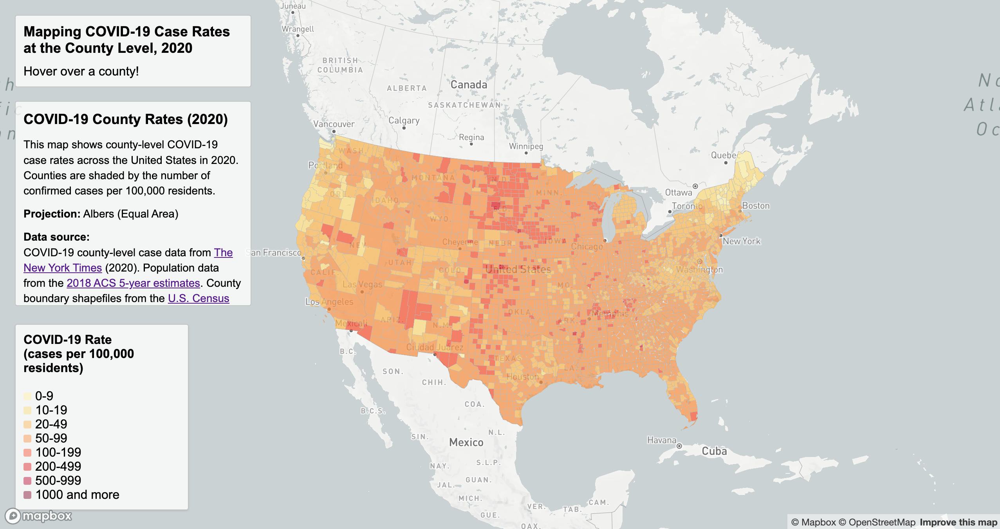
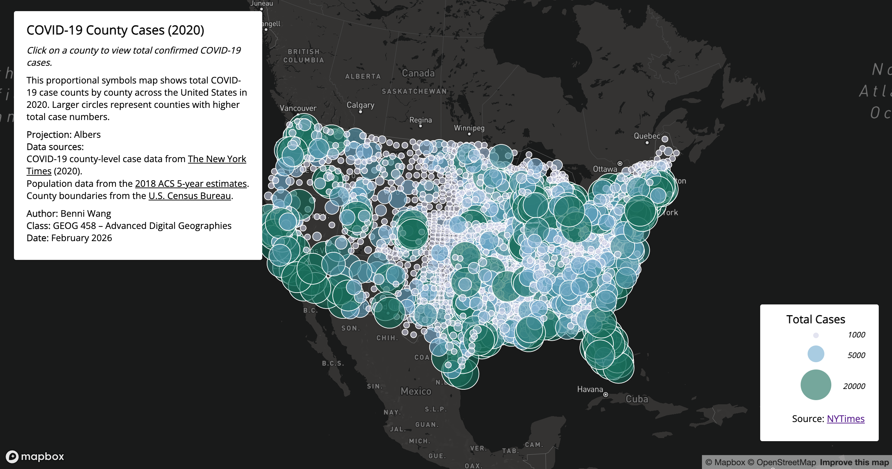

# COVID-19 in the United States (2020): County-Level Rates and Cases

## Project Overview
This project presents two interactive thematic web maps visualizing the spatial patterns of COVID-19 in the United States at the county level in 2020. The maps were created using Mapbox GL JS and focus on two complementary perspectives: (1) COVID-19 case rates normalized by population, and (2) total confirmed COVID-19 case counts represented through proportional symbols.

The goal of this project is to explore how different cartographic techniques—choropleth mapping and proportional symbol mapping—communicate public health data differently, while also practicing interactive web mapping workflows.

---

## Live Maps
- **Map 1 – Choropleth Map (COVID-19 Case Rates)**
  [View map1.html](https://www.github.com/your_github_username/your_repository_name/map1.html)

- **Map 2 – Proportional Symbols Map (COVID-19 Total Cases)**
  [View map2.html](https://www.github.com/your_github_username/your_repository_name/map2.html)

---

## Screenshots
- ### Map 1 – Choropleth Map: COVID-19 County Case Rates (2020)

### Map 2 – Proportional Symbols Map: COVID-19 County Total Cases (2020)

---

## Map Descriptions

### Map 1: COVID-19 County Case Rates (Choropleth)
- Displays county-level COVID-19 case rates (cases per 100,000 residents).
- Uses a stepped color scheme to classify rates into meaningful intervals.
- Includes hover interaction to display county name, state, and rate value.
- Legend, title, and supplementary information are displayed as map overlays.

### Map 2: COVID-19 County Total Cases (Proportional Symbols)
- Displays total confirmed COVID-19 cases by county using scaled circle symbols.
- Larger circles represent counties with higher total case counts.
- Click interaction allows users to view exact case numbers in a popup.
- Legend explains symbol sizes and data magnitude.

---

## Primary Functions and Interactivity

### Covered in Lectures
- Loading GeoJSON data using `map.addSource()`
- Adding layers (`fill` and `circle`) with `map.addLayer()`
- Hover and click interactions (`mousemove`, `click`)
- Dynamic legends using HTML and CSS overlays

### Functions Not Explicitly Covered in Lectures
- **Proportional symbol scaling using `circle-radius` stops**
  Circles dynamically scale based on data values using `stops`, allowing visual comparison of magnitudes.
- **Data normalization and classification decisions**
  Case rates were pre-processed and mapped using meaningful breakpoints for public health interpretation.
- **Separation of concerns**
  Code is modularized into separate HTML, CSS, and JavaScript files for each map, following best web development practices.
- **Explicit cartographic metadata**
  Projection type, data sources, and authorship are clearly documented in-map and in this README.

---

## Libraries and Tools Used
- **Mapbox GL JS** – Interactive web mapping library
- **OpenStreetMap** – Base map data
- **HTML / CSS / JavaScript** – Web development
- **Live Server (VS Code)** – Local development environment

---

## Data Sources
- **COVID-19 Case Data (2020):**
  The New York Times COVID-19 Dataset
  https://github.com/nytimes/covid-19-data

- **Population Data:**
  2018 American Community Survey (ACS) 5-Year Estimates
  https://data.census.gov

- **County Boundary Shapefiles:**
  U.S. Census Bureau Cartographic Boundary Files
  https://www.census.gov/geographies/mapping-files/time-series/geo/carto-boundary-file.html

*All datasets were processed and simplified for the purposes of this lab.*

---

## Projection
- **Visualization Projection:** Web Mercator (Mapbox GL JS)
- The maps are visually centered for the contiguous United States.
- Albers Equal Area projection is discussed conceptually as a preferred projection for U.S.-wide thematic mapping, though Mapbox GL JS internally renders data in Web Mercator.

---

## Author and Course Information
- **Author:** Benni Wang
- **Course:** GEOG 458 – Advanced Digital Geographies
- **Institution:** University of Washington
- **Date:** February 3 2026